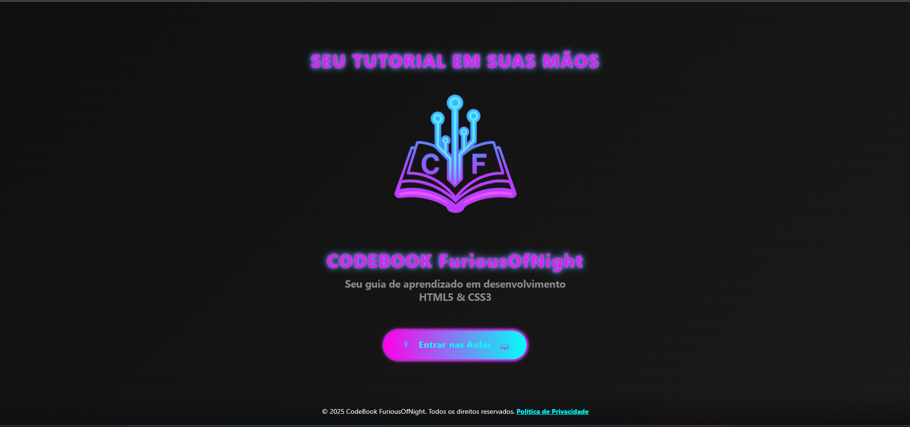

# 🐉 FuriousOfNight Portfolio

Um portfólio profissional desenvolvido com HTML, CSS e JavaScript puros, focando em performance, acessibilidade e design responsivo.

## 🚀 Características

- **Design Responsivo**: Layout adaptável para todos os dispositivos
- **Performance Otimizada**: Carregamento rápido e eficiente
- **Acessibilidade**: Seguindo as melhores práticas de a11y
- **Dark Theme**: Design moderno com tema escuro
- **Animações Suaves**: Interações fluidas e agradáveis
- **Zero Dependencies**: Desenvolvido sem frameworks ou bibliotecas externas

## 🛠️ Tecnologias

- HTML5 semântico
- CSS3 moderno (Grid, Flexbox, Variáveis)
- JavaScript puro
- SVG otimizados
- Lazy loading para imagens

## 📱 Seções

1. **Hero**: Apresentação inicial com foto e CTA
2. **Sobre**: Informações pessoais e skills
3. **Projetos**: Portfólio de trabalhos
4. **Serviços**: Ofertas de serviços
5. **Contato**: Formulário integrado com WhatsApp

## 🎨 Recursos Visuais

- Gradientes sutis
- Efeitos de blur
- Elementos com glassmorphism
- Animações em hover
- Cores harmoniosas

## 📦 Estrutura do Projeto

\`\`\`
portfolio/
├── assets/
│   ├── foto-perfil.jpg
│   ├── social-icons.svg
│   └── thumbnails/
├── css/
│   ├── style.css
│   └── contact-section.css
├── js/
│   └── main.js
└── index.html
\`\`\`

## 🚀 Deploy

O site está atualmente hospedado e pode ser acessado em:
- [Link do Portfolio](https://furiousofnightt.github.io/portfolio-pessoal/)

## ⚡ Performance

- Lighthouse Score: 90+
- First Contentful Paint: < 1.5s
- Time to Interactive: < 2s
- Performance otimizada para mobile

## 🔒 Segurança

- HTTPS por padrão
- Headers de segurança configurados
- Sanitização de inputs
- Links externos seguros (rel="noopener noreferrer")

## 📱 Responsividade

O site é totalmente responsivo com breakpoints em:
- Desktop (1200px+)
- Laptop (1024px)
- Tablet (768px)
- Mobile (480px)

## 🛠️ Desenvolvimento Local

1. Clone o repositório:
\`\`\`bash
git clone https://github.com/FuriousOfNightt/portfolio-pessoal.git
\`\`\`

2. Abra o projeto:
\`\`\`bash
cd portfolio
\`\`\`

3. Inicie um servidor local:
\`\`\`bash
# Usando Python
python -m http.server 8000

# Usando Node.js
npx serve
\`\`\`

4. Acesse `http://localhost:8000` no navegador

## 🤝 Contribuições

Contribuições são bem-vindas! Sinta-se à vontade para:
- Reportar bugs
- Sugerir melhorias
- Enviar pull requests

## 📄 Licença

Este projeto está sob a licença MIT. Veja o arquivo [LICENSE](LICENSE) para mais detalhes.

## 📞 Contato

- Email: Henriquecosta1322d@gmail.com
- GitHub: [@FuriousOfNight](https://github.com/FuriousOfNightt)
- Instagram: [@furiousofnightgames](https://instagram.com/furiousofnightgames)
- TikTok: [@furiousofnightgames](https://www.tiktok.com/@furiousofnightgames)

---

Desenvolvido por FuriousOfNight Dev
